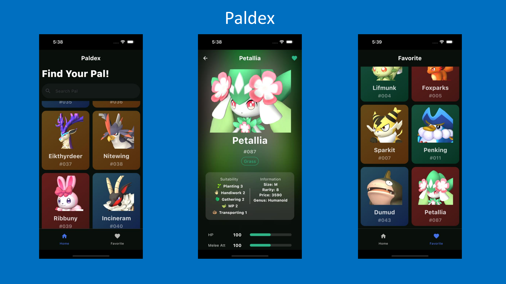
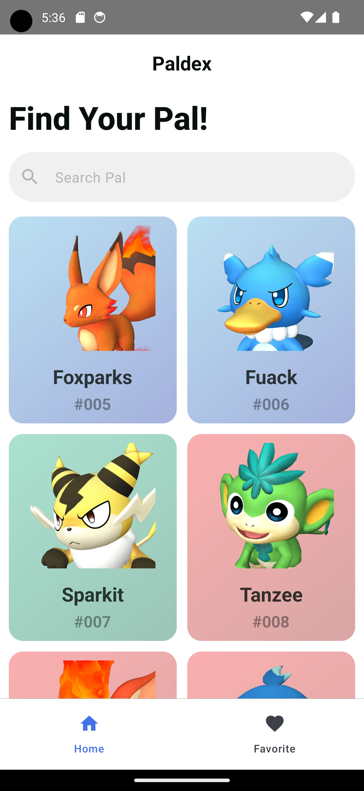
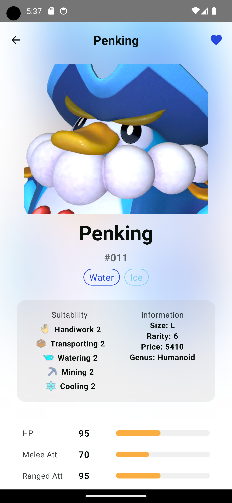
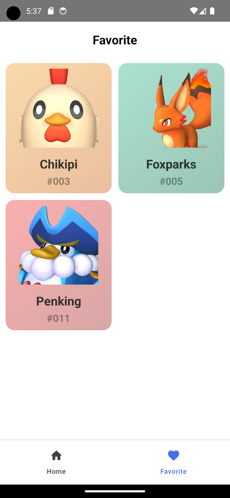
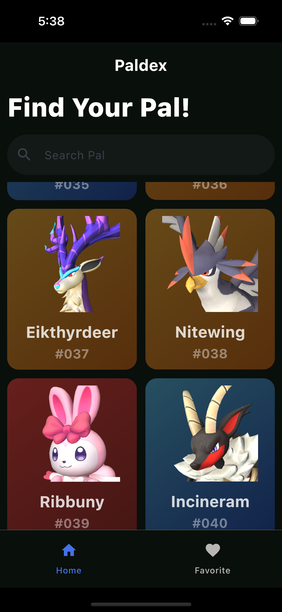
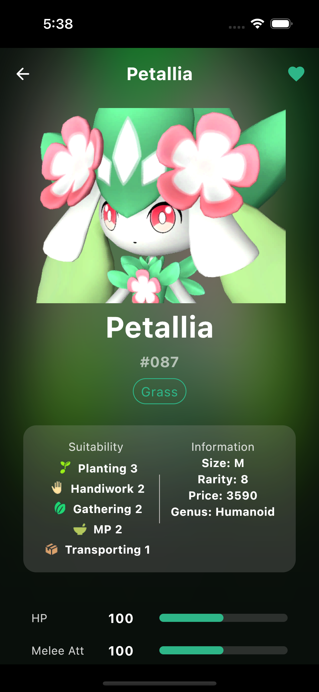
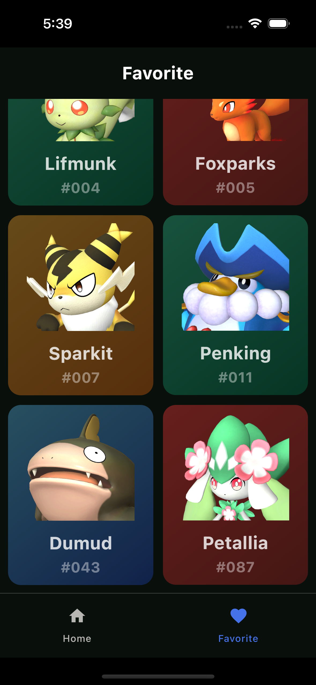

  

  

  

## Features

- All Pal monsters and their information in Palworld.
- Save your favorite Pals.
- Support offline data when you have no internet connection.
- Support Light / Dark mode.

## Showcase
### Android
  

  
  
  
  

### iOS
  

  
  
  
  

## Setup
### Palworld Paldex API
Paldex using the [Palworld Paldex API](https://github.com/mlg404/palworld-paldex-api) for constructing API. 

Step 1: Clone and setup [Palworld Paldex API](https://github.com/mlg404/palworld-paldex-api) repository to run server on local host.

Step 2: Sync project and run your app
### Android
Select `composeApp` configuration and run the project.

### iOS
Select `iOSApp` configuration and run the project.

## Technical Dependencies
- [Kotlin](https://kotlinlang.org/) based, [Coroutines](https://github.com/Kotlin/kotlinx.coroutines) + [Flow](https://kotlin.github.io/kotlinx.coroutines/kotlinx-coroutines-core/kotlinx.coroutines.flow/) for asynchronous.
- [Composable Multiplatform](https://jb.gg/compose) for building common UI. It simplifies and accelerates UI development on Android, iOS and Desktop.
- [Koin](https://insert-koin.io/) for dependency injection.
- [Ktor & Kotlin Serialization](https://ktor.io/)for constructing the REST APIs and paging network data.
- [SqlDelight](https://github.com/cashapp/sqldelight) for caching data in local database.
- [Kamel](https://github.com/Kamel-Media/Kamel) for loading images from network.
- [Voyager](https://github.com/adrielcafe/voyager) for navigation and screen models.

- Architecture:
  - MVVM Architecture (View - ViewModel - Model)
  - Repository Pattern

## Find this repository useful? :heart:
Support it by joining __[stargazers](https://github.com/viethua99/Paldex/stargazers)__ for this repository. :star:  
Also, __[follow me](https://github.com/viethua99)__ on GitHub for my next creations! 🤩

## License

**Paldex** is distributed under the terms of the Apache License (Version 2.0). See the
[license](LICENSE) for more information.